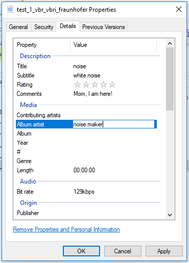
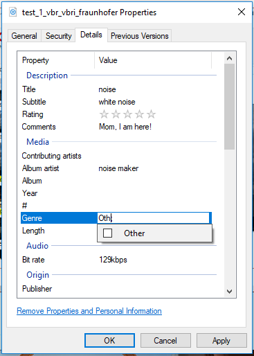
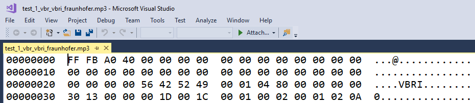
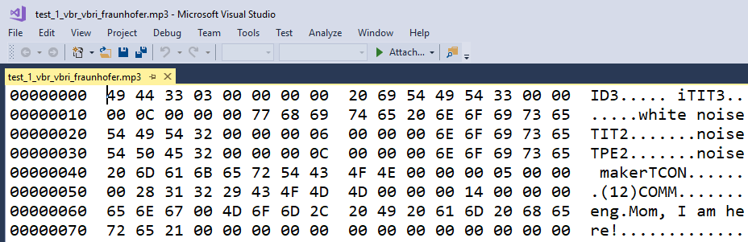
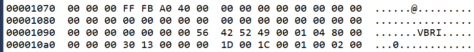

# ID3 Tags

_ID3_ is a metadata container that stores information such as the title, artist, album, track number, ..., etc as _tags_.

## How to edit ID3 tags

### On Windows

You can edit or insert _ID3_ tags directly on _Windows_.
You can edit the file properties by _right-clicking_
and select _properties_. Then you can edit the _tags_ directly
as the following figures.

To make sure the _tags_ are inserted to a file without any _tags_ before editing, you can simply check its source with _visual studio_. For example, the bytes in the begining of a _mp3_ file is a header:

After the _tags_ are inserted, the _ID3_ tags may be inserted in the begining of the file and *offset* the header behind:

### On other platforms
Lots of open source ID3 tags editors are free to use. Just choose one you like if you are on other platforms.

- [MusicBrainz Picard](https://picard.musicbrainz.org/)
- [EasyTAG](https://wiki.gnome.org/Apps/EasyTAG)
- [kid3](https://kid3.sourceforge.io/)
- [puddletag](https://docs.puddletag.net/index.html)
